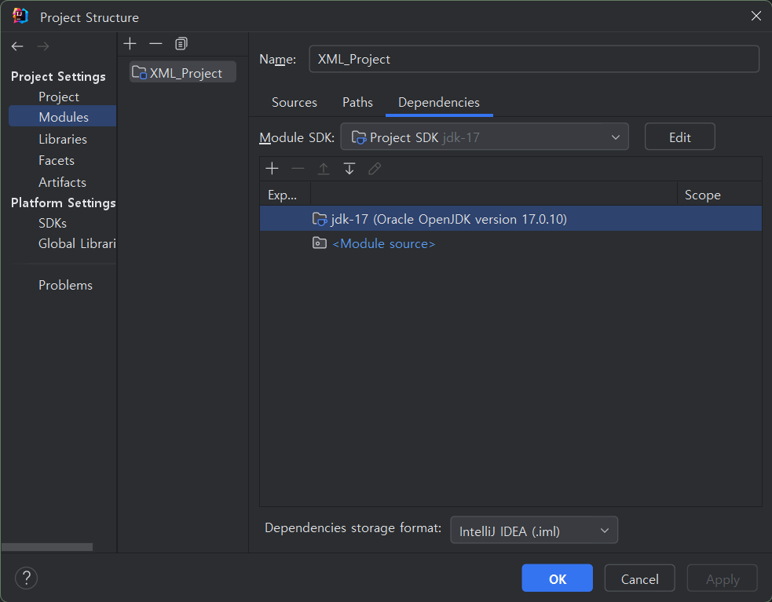
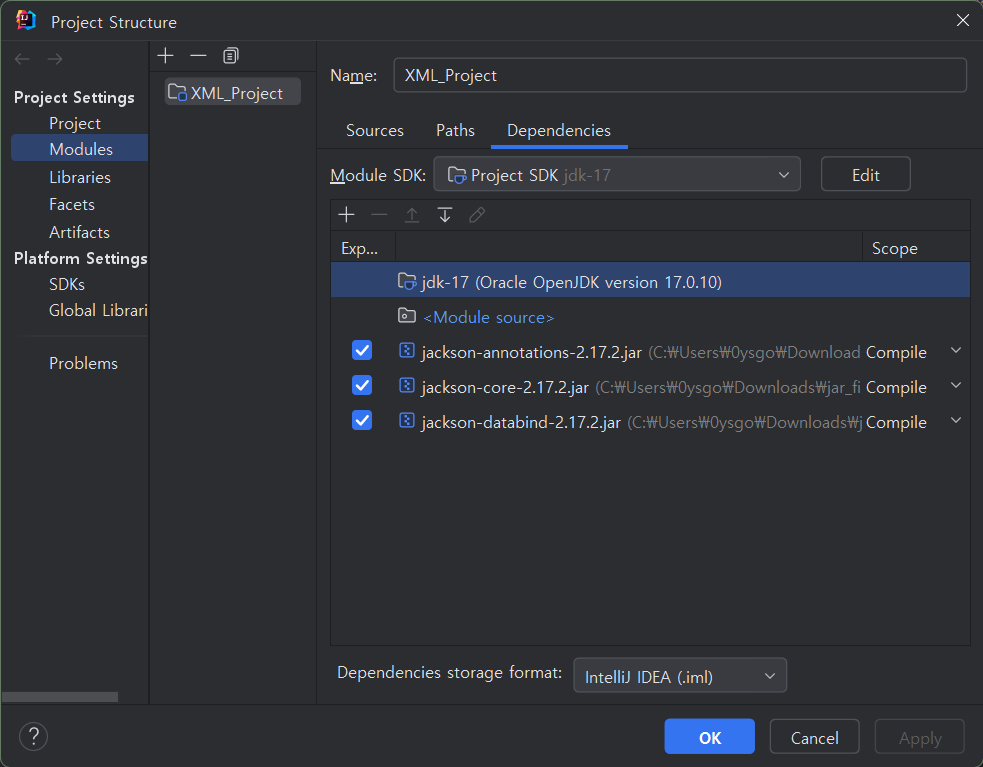

# XML 실습
## SAX Parser
SAX parser : Simple API for XML parser
- 문서를 읽으면서 태그의 시작, 종료 등 이벤트 기반으로 처리하는 방식임
- 빠르고 한번에 처리하기 때문에 다양한 탐색이 어려움

- SAXParserFactory로 생성한 SAXParser객체를 이용해서 XML 문서를 파싱함
- DefaultHandler를 상속받아 재정의하는 MyHandler(지금 이 코드)를 이벤트 발생 시 호출함

## DOM Parser
DOM Parser : Document Object Model parser
- 문서를 다 읽고 난 후(메모리에 올림) 문서 구조 전체를 자료구조에 저장하여 탐색하는 방식임
- 다양한 탐색이 가능하지만 느리고 무거우며 큰 문서를 처리하기 어려움

- DocumentBuilderFactory로 DocumentBuilder를 생성하여 DOM Tree를 구성함
- DOM Tree는 문서를 구성하는 모든 요소를 Node(태그, 속성, 값)으로 구성하며,
- 태그들은 root 노드(주소록)을 시작으로 부모-자식의 관계를 구성함

# JSON 실습
[여기]([https://jar-download.com/download-handling.php](https://jar-download.com/artifacts/com.fasterxml.jackson.core#google_vignette))에서 jar 파일 다운로드
- jackson-annotations-2.17.2.jar
- jackson-core-2.17.2.jar
- jackson-databind-2.17.2.jar

File - ProjectStructure - Modules 에 +버튼 클릭해서 JARs or Directories 추가

